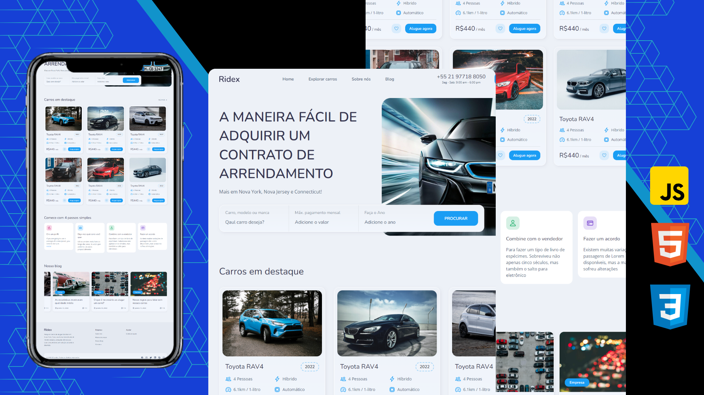

  
  

   
   
  
  

  <h2 align="center">Ridex - Site de aluguel de carros</h2>

  Ridex é um site de aluguel de carros totalmente responsivo,  responsivo para todos os dispositivos, construído usando HTML, CSS e JavaScript.

  <a href="https://ichumbo.github.io/Ridex/"><strong>➥ Site</strong></a>

 

### Demonstração

### Contato

Se você quiser entrar em contato comigo, pode entrar em contato comigo em [Linkedin](https://www.linkedin.com/in/ichumbo/).
